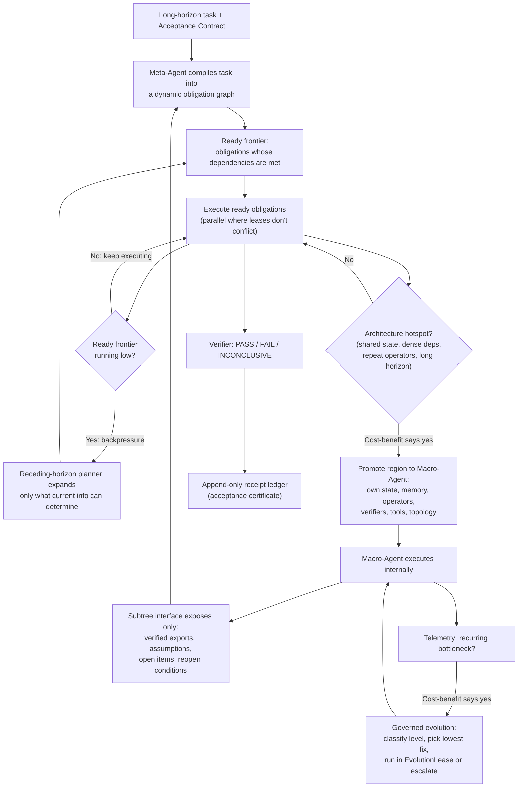

# Eureka: task-conditioned meta-agent orchestration for scientific discovery

Source: Alizer Wong (ManXis, corresponding author), Heng Cui (ManXis), Yi Tan, Xiongchao Zhan, Zixin Zeng (Guangdong University of Technology), Liang Lin (South China Normal University), Yuxiang Guo (Shanghai Jiao Tong University), Zhaorong Dai (Duke University), Wenyuan Li (Hokkaido University).
Title: "Eureka: Task-Conditioned Meta-Agent Orchestration for Scientific Discovery."
arXiv:2608.19047.
The paper's own header calls it a "Research Report."
It is dated August 2026.

## 1. Headline

Eureka is a system with one controlling agent, called the Meta-Agent.
The Meta-Agent reads a long open-ended task.
It builds a custom sub-agent for that task on the fly.
This replaces the usual approach of one fixed agent design for every task.
The paper reports strong numbers for its own orchestration engine.
Example: it completed 170 of 170 long tasks, with large token and compute savings.
The paper also reports unverified progress on two hard open problems.
One is the Riemann Hypothesis.
The other is a set of physics structures.
The paper does not test LangGraph, checkpointing, or crash recovery.
Those are ideas our lab is adding on top.
This deep-dive marks that line clearly throughout.

## 2. What the paper actually shows

### 2.1 A caution before the numbers

This paper reports progress toward the Riemann Hypothesis.
That is a famous unsolved problem in mathematics.
It also reports new structural results in physics.
Both came from an LLM agent system.
That is an extraordinary claim.
The paper labels its own document a "Research Report."
It is not a peer-reviewed publication.
The paper repeatedly hedges its own headline results; see section 2.7 below.
Treat every number here as "what the paper self-reports."
Do not treat it as independently confirmed fact.

### 2.2 Long-horizon orchestration, the core system claim

Eureka ran 170 long-horizon tasks.
That set was 50 fixed tasks plus 120 randomized tasks.
It completed all 170.
It produced 3,948 acceptance certificates.
A certificate is a machine-checkable record that one sub-task met its pass condition.
Across all 170 tasks, the paper reports zero uncertified accepts.
It also reports zero false terminal states and zero stagnation aborts.

Eureka runs sub-tasks as soon as their dependencies are ready.
It does not wait for fixed rounds.
This cut the median time to finish a task from 0.5058 seconds to 0.2724 seconds.
That is a 1.86x speedup.

### 2.3 Governed evolution: letting the system change its own setup

Eureka can rewrite parts of its own working setup mid-task.
It does this when it hits a repeated bottleneck.
The paper calls this ability governed evolution.
It compared four policies for when to trigger this, on the same task set.

| Evolution policy | Median total cost | Success rate |
|---|---|---|
| No Evolution | 2686.8 | 58.09% |
| Always Evolve | 3637.7 | 58.83% |
| Evolve on Stall | 2860.1 | 58.00% |
| Eureka Governed Evolution | 2525.4 | 60.55% |

Governed Evolution was the cheapest of the four.
It was also the most successful of the four.
A safeguard called EvolutionLease cut the number of approval round trips.
The median dropped from 12 round trips to 4, a 66.7% cut.
It also cut evolution-related cost by 11.5%.

### 2.4 Runtime efficiency: doing less repeated work

| Runtime mechanism | Reported result |
|---|---|
| Compiled active context | Median model input shrank from 9,490 to 4,005 tokens (57.8% cut); success rate unchanged |
| Incremental dependency rebuild | 65.38% of repeated computation avoided, across 12,000 dependency-update tasks |
| Dependency slicing | 56.69% cut in recomputation ratio |
| Closed common-subderivation reuse | 81.82% of duplicate evaluations avoided |
| Certified closed-replay page-in | 86.80% cut in page-in cost |
| Anytime verification | 81.5% median cut in samples needed to verify |

On 12,000 dependency-update tasks, two methods were compared.
Full recomputation and the faster incremental method always gave identical final answers.
Only 34.62% of nodes actually needed recomputing.

### 2.5 Concurrency: running things in parallel without corrupting shared state

Eureka ran 16,000 concurrent-execution tasks.
These tasks mix independent, conflicting, and dependent reads and writes.
Every one of the 16,000 final results matched some valid, non-parallel order of execution.
Zero of them produced an unsafe commit.
An unsafe commit is a write that silently corrupts shared state.

### 2.6 What the ablations show about the design choices

The paper tested its own design choices against simpler alternatives.
It held everything else fixed while doing this.

Planning strategy, compared by median total orchestration cost (lower is better):
Full Upfront Planning cost 11,573.5.
Recursive Polling cost 8,039.0.
Streaming without Backpressure cost 5,756.5.
Eureka's Receding-Horizon plus Backpressure cost 4,506.0, the cheapest of the four.
Note: it did not make the fewest planner calls, yet it was still cheapest overall.

Promotion strategy decides when to build a specialized sub-agent.
Eureka's Cost-Aware Lazy Promotion had a 0.04% false-promotion rate.
It landed within 0.64% of a computed cost-optimal reference (2,277.13 vs 2,262.65).
A simpler complexity-only rule had a 14.90% false-promotion rate instead.

### 2.7 The two scientific tracks

Eureka used the same Meta-Agent for two different tasks.
It built two different kinds of sub-agent from that one Meta-Agent.
One was a Theory-Discovery Agent, for open physics questions.
The other was a Math/Conjecture Agent, for the Riemann Hypothesis work.
Each had different internal memory.
Each had different tools.
Each checked its own answers a different way.

The Math/Conjecture Agent extended a mathematical bound.
That bound is called a localized Weil positivity certificate.
The paper's own framing: the new range is 0 < a ≤ 69/200 = 0.345.
That is 1.38x wider than the prior range, a ≤ 1/4.
It reaches about 99.55% of a reference value called the first-prime threshold.
That threshold is (log 2)/2, approximately 0.34657.
The paper states plainly: this is not a proof of the Riemann Hypothesis.
It is also not a new record for the proportion of zeros on the critical line.

The Theory-Discovery Agent produced five structural results.
These are in quantum-process and spacetime theory.
The five: full-rank conjunction interiorization, null-sector algebraic decoupling, a global acted-set normal form, behavioural-interface equivalence separation, and an operational intervention signature.
The paper states some of these "still require external or formal review."

## 3. The architecture and engineering

### 3.1 The obligation graph: how Eureka represents the task

Eureka does not store a long task as one big natural-language plan.
It stores the task as a dynamic obligation graph.
This is a directed graph of small work units, called obligations.
Each obligation carries five pieces of information.
These are: its goal, its known dependencies, the persistent state it reads, the persistent state it writes, and its Acceptance Contract.
An Acceptance Contract is an explicit, checkable definition of "done."
An obligation can only start once every obligation it depends on is accepted.

### 3.2 Receding-horizon planning: planning only what you can already trust

Eureka does not plan the whole task upfront.
It also does not plan one step at a time.
It expands only the part of the graph that current information can determine.
Work whose shape depends on an unknown answer is left as a deferred obligation.
A deferred obligation is a placeholder with a known information need, but no fixed plan yet.
The planner runs again only when the ready frontier runs low.
The ready frontier is the set of obligations whose dependencies are already met.
The paper calls this trigger backpressure.
The reasoning: planning a step too early risks planning invalidation.
Planning invalidation means a later observation proves that early plan wrong.
That wastes the tokens and structure spent building it.

### 3.3 Macro-Agents: when a region of the graph gets its own custom agent

As Eureka executes, it watches for architecture hotspots.
A hotspot is a region with heavy shared state, dense dependencies, repeated operator or verifier use, and a long remaining horizon.
Eureka compares the expected long-run saving against the one-time cost of building a custom setup.
If the saving wins, Eureka promotes that region into a Macro-Agent.
A Macro-Agent is not just a different prompt.
It gets its own state representation, memory policy, operator set, verifier set, tool bindings, and internal session structure.
Eureka compiles the smallest set of these components sufficient for the task.
It adds any optional component later, only when actually needed.

### 3.4 The subtree interface: keeping the parent's view small

Once a region is promoted, its internal reasoning stays inside it.
The parent Meta-Agent only sees a typed interface out of that subtree.
That interface exposes verified exported results, explicit assumptions, unresolved open items, and the exact conditions for reopening the result.
This is why compiled context stays smaller than raw history.
The parent's context grows with the number of promoted regions.
It does not grow with everything that happened inside each one.

### 3.5 Governed evolution: fixing the architecture, not just the answer

Eureka treats "should I change my own setup" as its own planning decision.
It uses the same cost-benefit discipline it uses for promotion.
When telemetry shows a recurring bottleneck, Eureka classifies it into one of seven levels.
From lightest to heaviest: runtime, prompt or operator, memory or skill, tool interface, state or verifier, topology, and model capability.
Eureka searches for the lowest level that can actually fix the problem.
It prefers that lighter fix over a heavier change.
A small, low-risk fix can run inside a bounded, revertible trial.
The paper calls this trial an EvolutionLease.
A structural change, like a new verifier rule or a new agent boundary, gets escalated instead.
That escalation goes to the Meta-Agent for full review.
Evolution proceeds only if the expected benefit outweighs the cost of diagnosis, testing, and migration.

### 3.6 Parallel execution: leases and serializability

Sometimes two obligations do not conflict on the state they touch.
Eureka runs those in parallel, using a mechanism the paper calls a lease.
A lease is a claim on which state a task intends to read or write.
At commit time, Eureka checks whether the leases actually stayed conflict-free.
If they did, the paper proves the result is equivalent to some valid, non-parallel order.
That proof is why the 16,000-out-of-16,000 result in section 2.5 holds.

### 3.7 The architecture, visually

### 3.8 What "checkpointing" means here, and why it is not in this paper

This is where our lab's proposal adds something the paper does not test.
The word "checkpoint" does not appear anywhere in the fetched text of this paper.
Eureka's own durability idea is the receipt ledger, from section 3.7 above.
That ledger is an append-only record of accepted results.
It has a separate "active" view.
That view can revoke a result's standing if something it depended on later turns out wrong.
This protects correctness over time.
It says nothing about what happens if the whole process is killed and must restart.

LangGraph is a separate, general-purpose framework for building agents as graphs of nodes.
Its checkpointer is what handles process-level restarts.
Per current LangChain documentation, a compiled LangGraph graph saves a checkpoint at every super-step.
A super-step is one full round in which all scheduled nodes finish running.
A checkpoint is a saved snapshot of the graph's State.
Each checkpoint is saved against a thread_id, an identifier for one run.
Re-invoking the graph with the same thread_id loads the most recent checkpoint.
Execution then continues from there, instead of starting over from the graph's START node.
One documented catch: if the process stops mid-super-step, that in-flight node re-runs from its own start on resume.
So any side effect inside that node, like writing a receipt, must be safe to run twice.
The documentation calls this property idempotent.

For our draft experiment in section 5, we define recovery efficiency ourselves.
It means how much already-completed work survives an interruption and resume.
We compare that against restarting the whole run from scratch.
This is our own operational definition, built for the experiment.
It is not a term from the paper.
The paper uses the word "recovery" twice, in two unrelated senses.
One is state-recovery cost tied to how good the underlying model is.
The other is a latency cost from pausing execution during an architecture migration.
Neither sense is about surviving a process crash.
Surviving a process crash is what our experiment measures.

## 4. How self-eval applies

### 4.1 Ground truth is different on the two tracks

On the Math/Conjecture track, ground truth is strong.
It rests on exact computation, formal or programmatic proof checking, and proof certificates.
None of those depend on the agent's own opinion of its work.
The paper reports 2,200 of 2,200 deterministic composite checks passing on this track.
It also reports 960 of 960 additional stochastic checks passing.
On the Theory-Discovery track, ground truth is weaker by nature.
Open theoretical claims in physics have no formal proof to check against.
There, Eureka leans on consistency checking, deliberate falsification attempts, and experimental or computational evidence instead.

### 4.2 A verifier gets three answers, not two

Eureka's acceptance check does not force a binary pass or fail.
For any obligation, it can return one of three answers.
PASS means a valid certificate exists.
FAIL means a valid refutation exists.
INCONCLUSIVE means neither exists yet.
The paper proves a specific failure mode.
Forcing INCONCLUSIVE down to FAIL is unsound when the verifier is simply incomplete.
Incomplete here means a true result exists that the verifier cannot yet certify.
Treating "not yet proven" as "proven false" creates a false negative.
A false negative wrongly discards a correct result.

### 4.3 Statistical claims get an anytime-valid check

Some obligations cannot produce an exact certificate.
They can only produce a threshold on a measured statistic.
For those, Eureka uses a confidence sequence.
A confidence sequence is a statistical interval that stays valid under adaptive stopping.
Adaptive stopping means the system decides mid-run when to stop collecting evidence.
This keeps the error rate on a mistaken PASS or FAIL bounded.
That bound holds even though the stopping point was chosen by the running system.

### 4.4 Proving the answer was not just looked up

The paper defines a sealed evaluator.
That is the held-out target value a result gets checked against.
It also defines a freeze time.
After freeze time, the production system may not read that target.
The paper proves a consequence of this isolation condition.
If isolation holds, the same production trace occurs no matter what the sealed target's value is.
That gives a concrete audit.
Run the system under two different sealed target values.
Check that the resulting trace hashes match.
A match means the target did not leak into the run.
The paper is honest about the limit of this proof.
It only shows the frozen runtime did not read the answer.
It does not show the architecture's designer was never influenced by already knowing the answer.

### 4.5 How this maps onto our own gates

Our lab's evaluation methodology already separates three splits.
See `docs/research/evaluation-methods.md`.
A dev split is used freely while iterating.
A gate split is touched only at promotion time.
A protected split holds regression invariants, changed only by explicit review.
That three-way split is the same idea as Eureka's sealed evaluator and freeze time.
In both cases, information the system is building toward must stay unreadable by the thing being measured.
Eureka's four-way evolution-policy comparison, in section 2.3, is structurally a small paired experiment.
Same task set, four conditions, compared on cost and success rate together.
That matches our own rule of never promoting on one metric alone.
Our statistical gates would compare the same shape of thing Eureka checks internally.
That shape is: a primary metric with a confidence interval.
Add a correctness guardrail that must not regress.
Add a verdict built from more than one condition.

## 5. Draft experiment for our lab

Status: draft, unregistered.
This is a proposal for review, not yet run or budget-approved.

### 5.1 Why this needs adaptation, not a direct replica

The paper does not measure crash recovery.
It does not measure checkpointing.
It does not use LangGraph at all.
It measures its own custom runtime's efficiency and correctness instead.
What we can build is motivated by Eureka's obligation-graph pattern.
It does not test anything Eureka itself tested.
The plan: a small LangGraph 1.2.11 graph, shaped like an obligation graph.
We ask whether LangGraph's checkpointer changes how much work survives a simulated crash.

### 5.2 Hypothesis

Take a LangGraph StateGraph that decomposes a task into dependent sub-steps.
Each sub-step is checked against one exact answer.
Adding a persistent checkpointer should reduce the cost to finish the task after a simulated mid-run crash.
We compare that against an identical graph with no checkpointer.
The final answer should not change either way.

### 5.3 Task

Reuse our lab's existing seeded, deterministic, offline-verifiable task-generator pattern.
That pattern comes from Experiment 002's arithmetic word problems.
Reshape it into a small dependency graph.
Each task has a fixed DAG of 8 to 12 sub-steps.
Each sub-step is a deterministic sub-computation with one exact-match answer.
This keeps grading free of any LLM judge.
That matches our evaluator stack's cheapest-first rule.
It also keeps every task independently checkable against an oracle answer, per our benchmark-hygiene checklist.
A fixed crash point interrupts execution after roughly half the sub-steps have an accepted receipt.

### 5.4 Arms (paired on identical task seeds and identical crash point)

- `no_checkpoint`: graph compiled with no checkpointer.
On the simulated crash, the run restarts.
Every node re-executes from START, including sub-steps already correctly finished before the crash.
- `checkpointed`: identical graph, identical prompts, identical task seeds.
Compiled with a persistent checkpointer and one fixed thread_id per task.
On the same simulated crash, the run resumes on that thread_id.
LangGraph loads the last completed super-step and executes only the remaining sub-steps.

The two arms differ only in checkpointer wiring.
That is the same "differ only in one thing" discipline our lab used in Experiments 001 and 002.

### 5.5 Metric and verdict gate

Primary metric: paired per-task delta in total_completion_cost.
This is the total tokens spent finishing a task, including the crash and resume, candidate minus baseline.
We expect a negative delta, meaning the checkpointed arm costs less.

Protected guardrail: final-answer correctness must be identical between arms.
This uses a non-inferiority margin of zero, checked deterministically.
If checkpointing changes the final answer, that is a correctness bug, not a tradeoff.
So this gate is a hard assertion, not a statistical test.

Secondary metrics, recorded but not gated: wall-clock resume latency, and the count of sub-steps re-executed after resume.
That re-executed count is the direct "wasted work" number.
It should sit near zero for the checkpointed arm.

Verdict, following our standard gate:
PROMOTE if the primary metric's confidence interval excludes zero in the expected direction, and the correctness guardrail holds exactly.
REJECT if the interval includes or crosses zero in the wrong direction.
INCONCLUSIVE otherwise, which triggers one re-sizing before any promotion decision.

### 5.6 Estimated cost on Nova Lite / Haiku 4.5 via Bedrock

Grounded in `docs/research/bedrock-model-pricing.md`.
Nova Lite is $0.06 / $0.24 per million input/output tokens.
Haiku 4.5 is $1 / $5 per million tokens, roughly 16 to 17x Nova Lite's per-token cost.
Each task now runs multiple sub-step calls instead of one.
So per-task token volume is higher than Experiment 002's single-call arithmetic tasks.
The figures below are illustrative planning anchors.
They should be replaced by the screening run's measured cost, per our own stated practice.
We do not trust pre-screening cost estimates as final numbers.

- Screening (Nova Lite): 15 tasks x 3 repeats x 2 arms = 90 trials, budget cap approx. $5.
- Sized run (Nova Lite): task count set from the screening run's measured per-task variance, using our standard power formula; budget cap approx. $15.
- Confirmation (Haiku 4.5, only if the sized run returns PROMOTE): 15 tasks x 3 repeats x 2 arms = 90 trials, budget cap approx. $10.
- Total budget cap: $30.00. Abort and surface if exceeded, per our standard practice.

### 5.7 Threats to validity (named at registration)

A synthetic, deliberately-timed crash may not represent real failure modes.
Real failures include a crash mid-tool-call, or a partial write.
The `no_checkpoint` arm's "restart from scratch" is close to a worst case.
A hand-rolled logging scheme could partly recover work without LangGraph's checkpointer.
So this experiment measures the value of the built-in mechanism specifically.
It does not measure the ceiling of what any recovery approach could achieve.
Per the LangGraph documentation cited in section 3.8, an in-flight node re-runs on resume.
So any node with a side effect needs an idempotency key.
Otherwise the resumed run could double-count that effect.
This must be verified in the harness before the sized run, not assumed.

## 6. Street-test questions

1. What five pieces of information does every obligation in Eureka's obligation graph carry?
2. Why does Eureka plan only the part of the task graph that current information can determine, instead of planning the whole task upfront?
3. What has to be true, in cost-benefit terms, before Eureka promotes a region of the obligation graph into a Macro-Agent?
4. What problem does the three-valued PASS / FAIL / INCONCLUSIVE verifier fix, that a plain binary pass/fail verifier would get wrong?
5. Does the Eureka paper test LangGraph checkpointing or crash recovery?
If not, what is the closest thing it does test, and how is that different from what our draft experiment measures?

---

### Answers

1. Its goal, its known dependencies, the persistent state it reads, the persistent state it writes, and its Acceptance Contract.
The Acceptance Contract is an explicit, checkable definition of "done."

2. Planning a future step too early risks planning invalidation.
A later observation can prove that early plan wrong, wasting the tokens and structure spent building it.
Expanding only what current information supports avoids paying for branches that get thrown away.

3. The expected long-run saving from giving that region persistent, specialized state, memory, operators, verifiers, and tools must outweigh the one-time cost of building it.
The paper calls this an amortization threshold.
Promoting a region that will not be revisited enough times to earn back that cost is a net loss.

4. A binary verifier forces every unproven result into either PASS or FAIL.
When the verifier is simply incomplete, a true result may exist that it cannot yet certify.
Forcing that case to FAIL creates a false negative: a correct result gets wrongly recorded as false.
The three-valued version keeps "not yet proven" separate from "proven false."

5. No.
The word "checkpoint" does not appear anywhere in the paper's text.
The closest thing it tests is an append-only receipt ledger, which protects correctness over time.
It uses "recovery" only for state-recovery cost tied to model strength, and for a migration-pause latency cost.
Neither of those is about surviving a process crash.
Our draft experiment measures something the paper never touches: whether LangGraph's checkpointer preserves already-completed work after a simulated crash kills the whole process.
