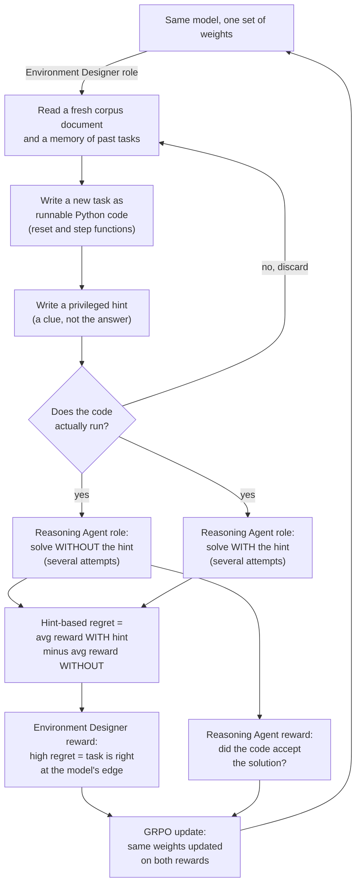
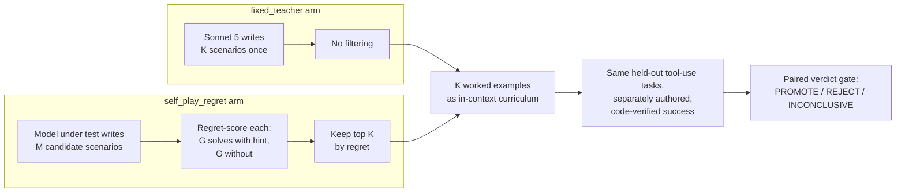

# SPADE: self-play in adaptive synthetic executable environments

Source: Liu, Yu, Jiang, Qu, Zhao, Liu, Kim, Zhou, Kim, Ren, Liu, Yu, Chen, Shi, Liang, Zettlemoyer, Choi, Jaques (University of Washington, Stanford, Northeastern, Carnegie Mellon, MIT, National University of Singapore, Seoul National University, Stevens Institute of Technology, University of Chicago).
"SPADE: Self-Play in Adaptive Synthetic Executable Environments."
arXiv:2608.19197.

## 1. Headline

SPADE trains one language model to do two jobs.
First, it writes new training tasks as runnable Python code.
Second, it solves those same tasks.
The model scores its own tasks by how much a hint helps it succeed.
That self-generated score decides which tasks are worth training on.
At 30 billion parameters, this beats a fixed task pool by 5.3 points on average, across eight held-out benchmarks.
Tool-use gains reach as high as 13.9 points.

## 2. What the paper actually shows

### The setup

SPADE stands for Self-Play in Adaptive Synthetic Executable Environments.
One model, with one set of weights, plays two roles.
Two different system prompts select the role.
As the Environment Designer, it writes a complete training task as an executable Python program.
As the Reasoning Agent, it acts inside that same program and tries to solve it.
Both roles update the same shared weights, through reinforcement learning.
The paper trains three backbone sizes: Qwen3-4B-Instruct-2507, Qwen3-8B, and Qwen3-30B-A3B-Instruct-2507.
It calls the 30B-A3B model its primary model.
The name "30B-A3B" comes from Qwen3's own naming scheme for a mixture-of-experts model.
The fetched paper text does not spell out what "A3B" stands for.
Treat that expansion as unverified background, not a claim from the paper.
The paper tests two task domains.
The first is "games," a set of six cognitive-skill categories.
These are math reasoning, logical deduction, spatial reasoning, pattern recognition, optimization, and causal inference.
The second domain is "tool use": simulated, multi-step, API-calling tasks.

### Games setting results

Table 1 in the paper reports results on eight held-out benchmarks.
None of these eight benchmarks is used during training.
The set is two competition-math benchmarks (AIME 2025 and 2026), one science benchmark (GPQA-Diamond), one code benchmark (LiveCodeBench-v6), and four Reasoning-Gym procedural-reasoning categories.
At 30B-A3B, the untrained base model averages 50.2 across the eight benchmarks.
A matched-budget baseline trained on a fixed, hand-engineered task set (Fixed-env RLVE) reaches 53.0.
That is a gain of 2.8 points.
SPADE reaches 58.3.
That is a gain of 8.1 points over the base model.
It is a gain of 5.3 points over the strongest fixed-environment baseline.
In the games setting, this gain over the fixed baseline grows with model scale.
The paper reports a gain of 5.2 points over base at 4B.
It reports 5.7 points at 8B.
It reports 8.1 points at 30B-A3B.
The gains concentrate on procedural reasoning.
Every Reasoning-Gym category improves, by 5.8 to 14.7 points at 30B-A3B.
Competition-math scores stay roughly flat.
The paper reads this as evidence that training on self-generated games transfers to unrelated skills, not just to games.

### Tool-use setting results

Table 2 reports three multi-turn tool-use benchmarks.
These are BFCL v4 multi-turn, tau-squared-bench, and ACEBench-Agent.
At 30B-A3B, SPADE improves BFCL v4 multi-turn from 49.0 to 54.7.
That is a gain of 5.7 points.
It improves tau-squared-bench from 49.0 to 52.6, a gain of 3.6 points.
It improves ACEBench-Agent from 62.0 to 75.9, a gain of 13.9 points.
At 4B, the BFCL v4 multi-turn gain is larger in absolute terms: plus 10.3 points.
The paper compares SPADE at 30B-A3B against four dedicated data-synthesis systems.
These are AgentScaler, Agent-World, Agent World Model, and EnvScaler.
The paper states that SPADE leads all four on BFCL v4 multi-turn.
It also leads all four on ACEBench-Agent.
A self-play recipe with no domain-specific tool data beats systems built specifically to synthesize tool-use training data.

### What happens when a piece of the recipe is removed

Table 3 isolates each component of the recipe.
All rows use 30B-A3B on the games setting.
Removing the environment memory drops the average from 58.3 to 53.2.
Environment memory is a record of past tasks and their measured difficulty.
Removing corpus grounding drops the average to 53.5.
Corpus grounding means feeding the Environment Designer a fresh real-world document each round.
Freezing the Environment Designer and removing memory together drops the average to 40.5.
That is 9.7 points below the untrained base model.
A badly built self-improvement loop can make the model worse than no training at all.
The paper also tests a fixed, frontier model (GPT-5.5) as the Environment Designer, keeping corpus grounding and memory.
That variant reaches 53.0.
It beats the base model, but recovers only about 35 percent of SPADE's 8.1-point gain.
It does not improve code generation at all: 42.6, against a base of 43.2.

### Why the tasks stay diverse

Without corpus grounding, the Environment Designer collapses onto a small set of repeated tasks.
The paper measures this with a Vendi score.
A Vendi score counts how many effectively distinct tasks show up in a sample of outputs.
With corpus grounding, the score is 0.68 distinct tasks per 100 sampled.
Without corpus grounding, the score falls to 0.04.
The paper gives a concrete illustration of this collapse.
Over steps 290 to 312 of one run without corpus grounding, the Environment Designer wrote the same maze task 41 times in a row.

### What the reward-comparison ablation shows

The paper compares its hint-based regret reward against a simpler, cheaper alternative.
Hint-based regret is explained fully in Section 3 below.
The alternative scores a task by how far the Reasoning Agent's success rate departs from a moving average for that skill.
This alternative needs no extra hint-solving rollouts.
It reaches 55.9, a gain of 5.7 points.
That is about 70 percent of SPADE's 8.1-point gain with the full hint-based signal.
The paper's own reading: any signal that rewards edge-of-capability tasks helps a lot.
The specific hint-based signal still leads.

## 3. The architecture and engineering

### What an executable environment is

In everyday agent training, a "task" is often just a text prompt.
It is a question with one expected answer.
SPADE's Environment Designer instead writes a runnable computer program for each task.
The program follows the Gym-style interface.
This is a standard programming pattern from OpenAI's Gym library, now called Gymnasium.
A `reset()` function returns the task's starting state.
A `step()` function takes an action, updates the internal state, and returns the next observation, a reward, and whether the task is finished.
This is a full Markov decision process, or MDP.
An MDP is a formal description of a task: states, actions, a rule for how actions change the state, and a rule for scoring reward.
The reward and the pass/fail check both live inside the program's own code.
The program itself decides whether an attempt succeeded.
No separate human grader or judge model is needed to score a completed episode.
The same program format covers a single-question math problem: one `step()` call, then done.
It also covers a long, multi-turn tool-use task: many `step()` calls in a row.
One interface and one training pipeline covers both domains.

### How self-play generates the training signal

Each round, the Environment Designer reads one freshly sampled document.
For the games setting this is a math or science document.
For the tool-use setting this is a code or API document.
It also reads a memory of past tasks and their measured difficulty.
It writes a new task as a Python program.
It then writes a short privileged hint for that task.
A hint is a partial solution sketch or a key insight.
The hint does not give away the final answer.
The system then runs the Reasoning Agent on that task twice.
The Reasoning Agent is the same model, in its other role.
It makes several attempts with the hint shown in its context.
It makes several attempts without the hint.
The gap between the average reward with the hint and without it has a name.
The paper calls this gap hint-based regret.
That gap becomes the Environment Designer's own reward for having written the task.
A task with high regret is solvable when helped, but not solved unaided.
It sits right at the edge of what the model can currently do.
A task the agent solves either way, hint or no hint, teaches it nothing new.
A task it fails even with the hint is likely broken or too hard.
The paper names its source directly.
Hint-based regret implements the minimax-regret idea from PAIRED (Dennis et al. 2020).
PAIRED comes from an earlier, separate line of research called unsupervised environment design.
SPADE's version drops PAIRED's separate adversary model.
The hint-equipped Reasoning Agent stands in as its own upper-bound comparison instead.
Both rewards update the one shared set of weights.
The Environment Designer's regret reward and the Reasoning Agent's task-success reward both feed the same update.
The update method is Group Relative Policy Optimization, or GRPO.
For a batch of sampled attempts at the same task, GRPO scores each attempt against the batch average reward.
It then nudges the weights toward the better-than-average attempts.
One training run regenerates a batch of 24 tasks every few rollouts.
Games regenerate every 4 rollouts; tool use regenerates every 8.
Training runs for 400 rollouts total.
At each regeneration point, the paper measures 16 hint-attempts and 16 no-hint attempts per task.
This deep-dive did its own arithmetic on those numbers.
One training run puts each of roughly 9,600 generated tasks through 32 Reasoning Agent attempts.
That is close to 300,000 solving attempts in total.
This count does not include the Environment Designer's own task- and hint-writing calls.
This total is this deep-dive's own arithmetic from the paper's stated hyperparameters.
It is not a number the paper states directly.

### How this differs from distillation and from teacher-likelihood training

Distillation usually means training a smaller "student" model to copy a bigger "teacher" model.
Sometimes it copies the teacher's outputs directly.
Sometimes it matches the teacher's probability distribution over its next words; this is called teacher-likelihood training.
Both approaches need a fixed teacher model.
Both score the student by similarity to that teacher.
SPADE's Reasoning Agent is never scored by similarity to another model.
It is scored by whether the executable program's own code accepted its actions as correct.
That is a fact about the world the code represents, not an opinion from another model.
Its tasks are not written by a fixed teacher or a human curator either.
They are written by the same model being trained, in its Environment Designer role.
That role is itself trained every round.
Training keeps it landing tasks at the model's current capability edge.
Distillation fixes two things: the teacher, and the task set.
In SPADE, both are self-generated, and both keep moving.

### The self-play loop, visually

## 4. How self-eval applies

SPADE's whole training signal is the model judging its own attempts at its own self-written tasks.
No human ever labels a task as good or bad.
No separate reward model scores anything.
The executable code, plus the hint-versus-no-hint gap, is the entire evaluation.
This is a working example of an agent running an eval on itself, then acting on the result.
That is exactly the shape of AgentLab's own v0.5 north star.
The v0.5 goal is "long-horizon agents that run evals on themselves through the same [statistical] gates."

One structural difference is worth stating plainly.
SPADE's self-eval result changes the model's weights.
It does this through a GRPO gradient step, every round.
AgentLab's verdict gate is different.
The gate (PROMOTE / REJECT / INCONCLUSIVE) is built on a paired statistical comparison with a confidence interval.
It changes which prompt or technique the lab keeps using at inference time.
It never touches model weights.
Both are cases of a system judging its own work.
One consequence is baked permanently into the model.
The other is a reversible configuration choice.
That difference matters for how much scrutiny each kind of self-judgment deserves before it is trusted.

SPADE's own results are a useful warning for anyone designing a self-eval loop, including us.
Section 2 above described one ablation that freezes the Environment Designer and removes its memory.
That ablation does not just fail to help.
It drops the model 9.7 points below the untrained base.
A self-improvement loop that judges and reinforces itself on a broken signal does not just plateau.
It can actively make the agent worse than doing nothing.
This happened in a paper by a team of specialists who were watching for exactly this failure.
SPADE's own regret signal is also unguarded, by the standards AgentLab already holds itself to.
It is one hint-versus-no-hint gap, measured over 16 rollouts.
It carries no confidence interval and no held-out confirmation.
It is used directly as a live training reward, every round.
AgentLab's gate is built the opposite way, on purpose.
It uses paired seeds, a trial count sized from measured variance, and a reported confidence interval.
It has an explicit INCONCLUSIVE outcome that blocks promotion until more evidence arrives.
`docs/research/agent-improvement-literature.md`, already in this repo, collects papers on judges being gamed.
It also collects papers on evaluation pipelines being tampered with.
SPADE's own "worse than no training" ablation result is a second, independent demonstration of that same risk.
An unguarded self-judgment signal can fail badly, and silently.
Suppose AgentLab lets its own agents run its verdict gates on themselves, at v0.5.
This paper is evidence for keeping the paired design, the confidence interval, and the INCONCLUSIVE outcome.
Do not replace them with a single raw self-eval score, the way SPADE's own regret reward works.

## 5. Draft experiment for our lab

Status: draft, unregistered.
This is a proposal for review, not yet run or budget-approved.
Daniel flagged this paper as the strongest candidate for experiment 003.
This section is written to be ready for pre-registration, not just to summarize the paper.

### Why the proposal as written needs adapting

The lab's approved proposal talks about "agents trained with SPADE's self-play."
It compares that against "baseline distillation" and "teacher-likelihood baselines."
Read literally, that is the paper's actual method: an RL training loop that updates model weights every round.
AgentLab's current fabric runs inference-time experiments on Bedrock-hosted models (Nova, Haiku, Sonnet).
It does not fine-tune any model.
Bedrock's Converse API does not expose weights or gradients for these hosted models.
So a literal replication is not buildable on our stack today.
What follows splits the work in two.
First, what we can run now, at inference time only.
Second, what a real replication would need.

### In reach now: an inference-time analog

One part of SPADE we can test without training: its core claim about task curation.
The claim is that regret-targeted, self-generated tasks are worth more than a fixed, teacher-written task set.
We can test that claim by using regret scoring to curate a set of tasks.
We then use that task set as in-context material, with no weights ever updated.

**Task family.**
This adds a new Inspect task family, alongside the lab's existing compaction and arithmetic families.
It is built around small, multi-turn tool-use scenarios.
Each scenario has a simulated backend state, for example a support-ticket system.
Its tools might be `search_ticket`, `update_ticket`, and `issue_refund`.
Each scenario also has a natural-language user request.
The request needs three to five correctly-ordered tool calls to satisfy.
Success is checked by comparing the final backend state to a target state, in code.
This is the same code-verified, no-judge pattern the lab already uses for compaction recall.
It is the same pattern used for the arithmetic task's exact-match scorer.
One deliberate simplification versus the paper: we do not let the Environment Designer emit arbitrary executable Python.
The paper's team can sandbox arbitrary code on their own training cluster.
We instead constrain the Designer to a fixed JSON scenario schema.
Our own fixed Python interpreter turns that schema into a runnable checker.
This trades away some of the paper's "any computable MDP" generality.
In exchange, it stays buildable and safe on our current stack, with no general code sandbox needed.
This is a named threat to validity, not something the paper itself did.

**Hypothesis.**
Hold the curriculum size fixed across both arms.
The candidate curriculum is generated and regret-filtered by the model under test, at inference time, with no weight updates.
The baseline curriculum is generated once by a fixed strong model, with no filtering.
Hypothesis: the candidate curriculum improves the model's held-out multi-turn tool-use success rate more than the baseline curriculum.

**Arms, paired on identical held-out task seeds.**

- `fixed_teacher` (the distillation-style baseline): K scenarios generated once by a fixed strong model (Sonnet 5).
This is a single pass, with no regret filtering.
It stands in for a static, teacher-written curriculum, since we cannot train on a teacher's token probabilities either.
- `self_play_regret` (the candidate): M candidate scenarios generated by the model under test, in the Environment Designer role.
Each candidate is regret-scored: the same model, as Reasoning Agent, solves it G times with the scenario's hint and G times without.
The top K scenarios by regret are kept.

Both curricula are then used identically.
Each is placed in context, as K worked examples: a scenario plus a successful tool-call trace.
The model then attempts a held-out set of separately authored tool-use tasks.
Those held-out tasks appear in neither curriculum.
One piece of the paper's own vocabulary is worth calling out directly here.
Hint-based regret is the paper's implementation of the minimax-regret idea from PAIRED (Dennis et al. 2020).
So this design is "paired" in two senses at once.
One is the lab's own paired-seed statistical design.
The other is the specific regret-based selection principle the paper borrows from the PAIRED line of work.

**Metric.**
Primary: held-out task success rate, binary, code-verified.
It is paired by held-out task ID across the two arms.
This matches the lab's standard paired-delta design.
Protected: total inference cost per curated task.
The candidate arm pays for 2 times G scoring rollouts per candidate, on top of generation.
The baseline arm only pays for one generation call per curated task.
This cost asymmetry needs a named allowance.
Experiment 001 set a similar precedent: it capped the structured prompt's extra cost at 50 percent over baseline.

**Verdict gate.**
Use the lab's existing PROMOTE / REJECT / INCONCLUSIVE gate.
Run a screening pilot first, then a sized run.
Target MDE 0.10 on held-out success rate, alpha 0.05, power 0.8.
Set the task count from the screening pilot's measured variance, exactly as in experiments 001 and 002.

### Experiment pipeline, visually

### What would need training infra (the literal proposal, a later, bigger effort)

A real replication of SPADE's actual method needs an RL training loop.
That loop must run on an open-weight model we host ourselves.
Bedrock does not expose gradients for its hosted models, so this cannot run there.
Three things would be needed.
First, a GPU training cluster: SageMaker or self-managed EC2 with GPUs.
This is not the CPU-only Fargate fabric the lab runs experiments on today.
Second, an RL framework that supports this kind of dual-role policy update.
The paper's own training backbone is called slime.
Naming specific open alternatives here would be unverified general background, not a claim from this paper.
Third, a real code-execution sandbox.
A trained Environment Designer would need to emit and run arbitrary Python, not our constrained JSON schema.
Section 3 above estimated roughly 300,000 solving attempts for one of the paper's own training runs.
A faithful replication is a GPU-infrastructure project on that scale.
It belongs on the lab's v0.4/v0.5 roadmap, not folded into experiment 003.
The inference-time analog above is the honest, buildable middle step.
It tests the paper's task-curation claim now.
Its result, PROMOTE, REJECT, or INCONCLUSIVE, is itself evidence for whether the bigger training-infra investment is worth proposing later.

### Estimated cost on Nova Lite / Haiku 4.5 via Bedrock

These numbers are grounded in `docs/research/bedrock-model-pricing.md`.
Nova Lite is $0.06 / $0.24 per million input/output tokens.
Haiku 4.5 is $1 / $5 per million tokens.
This task family is heavier than the lab's existing arithmetic and compaction tasks.
It needs multi-turn tool calls, a scenario-generation step, and a regret-scoring step.
The regret-scoring step doubles the solving attempts per candidate task.
So per-trial costs will run well above the roughly $0.02 Nova Lite anchor measured on the lab's simpler tasks.
The numbers below are rough planning anchors, not measured costs.
The screening stage exists specifically to replace them with a measured cost, before the sized run is committed.
Experiment 001's knobs were amended after its own screening pilot in exactly this way.

- Screening (Nova Lite): small M and K (for example M=12, K=4), G=2 scoring rollouts, 5 held-out tasks x 2 repeats. Estimated under $8.
- Sized run (Nova Lite): task count set from the screening pilot's measured variance at MDE 0.10, M and K scaled to match. Estimated $20-30.
- Confirmation (Haiku 4.5): re-running the full regret-scoring pipeline at Haiku's roughly 16-20x per-token cost would be disproportionate.
Confirmation instead reuses the Nova-Lite-curated curricula.
It only re-runs the held-out evaluation step, with Haiku 4.5 as the model being evaluated.
This checks whether the curriculum's effect transfers to a stronger tier, without re-deriving the curriculum at that tier. Estimated under $10.
- Budget cap: $40.00 total. Abort and surface if exceeded, per standard lab practice.

This makes 003 the most expensive experiment run in this lab so far.
It is still comfortably inside the $1,000 credit budget and the $50/month spend alarm.

## 6. Street-test questions

1. What two roles does the one SPADE model play, and what does each role produce?
2. What is hint-based regret, and why does a HIGH regret score mean a task is well-targeted rather than just hard?
3. Name the two components the paper shows are necessary to stop the Environment Designer from repeating itself, and give the diversity number that shows their effect.
4. What is the main reason we cannot run SPADE's literal method on AgentLab today, and what do we build instead for draft experiment 003?
5. Which single ablation in the paper produced the worst result, and what lesson does it carry for a self-eval loop?

---

### Answers

1. As the Environment Designer, the model reads a corpus document and its memory of past tasks.
It then writes a new task as executable Python code, plus a hint.
As the Reasoning Agent, the same model, in a different role, tries to solve that task, with and without the hint.
Both roles update the same shared weights.

2. Hint-based regret is the gap between two average rewards.
One is the Reasoning Agent's average reward when it sees the hint.
The other is its average reward when it does not.
A high gap means the task is solvable once helped, but not solved unaided.
That is exactly the model's current capability edge.
A task solved either way teaches nothing new.
A task failed even with the hint is likely too hard or broken.

3. Corpus grounding and environment memory are the two components.
Corpus grounding means a fresh real-world document each round.
Environment memory means a record of past tasks and their difficulty.
Without corpus grounding, the diversity score (Vendi score per 100 samples) falls from 0.68 to 0.04.
One run without corpus grounding repeated the same maze task 41 times in a row.

4. AgentLab runs inference-time experiments on Bedrock-hosted models and does not fine-tune any model.
Bedrock's Converse API does not expose gradients for those hosted models.
So SPADE's actual RL training loop cannot run on this stack.
Draft experiment 003 instead tests the paper's task-curation claim only, at inference time.
It curates an in-context curriculum by regret-scoring the model under test.
It compares that against a fixed-teacher curriculum, with no weights ever updated.

5. Freezing the Environment Designer and removing its memory produced the worst result.
That result was 40.5 on the eight-benchmark average.
The untrained base model scored 50.2, so this is 9.7 points below base.
The lesson: a self-improvement loop judging itself on a broken or under-guarded signal does not just plateau.
It can make the model worse than doing nothing at all.
That is exactly why a self-eval loop needs guardrails, like a paired design and a confidence interval.
A raw self-generated score is not enough on its own.
