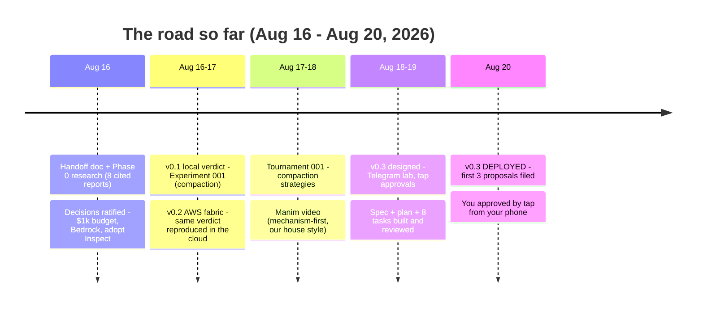
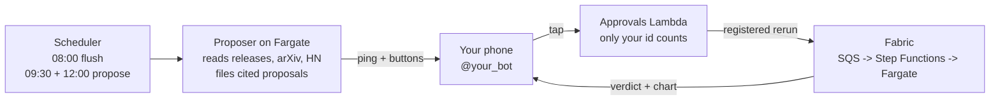

# AgentLab: where we started, what we built, where we go

One line: in 5 days we went from a brainstorm doc to a lab that runs experiments in the cloud, produces honest statistical verdicts, and now proposes its own work to your phone.
Motto: you can outsource the thinking, but you can't outsource the understanding.

## What each version is

| Version | What it does | Status |
|---|---|---|
| v0.1 | Local statistical verdicts: paired experiments, CI gates, PROMOTE / REJECT / INCONCLUSIVE | Done |
| v0.2 | The cloud fabric: SQS -> Pipe -> Step Functions -> Fargate -> DynamoDB + S3, Terraform, $50 alarm | Done |
| v0.3 | The loop: proposer runs at 09:30 and 12:00, pings your phone, you steer by taps | **Live now** |
| v0.4 | Longer leashes: persistent workspaces, richer tools, videos rendered in the cloud | Next |
| v0.5 | North star: long-horizon agents that run evals on themselves through the same gates | The goal |

## What we actually learned (the science)

1. Generic "summarize concisely" prompts discard almost all exact identifiers, at every model tier (Experiment 001-A).
2. Codes-first budget allocation beats general structured prompting: +27pp on Nova, +14pp on Haiku (001-B).
3. The three-tier cliff: no intent ~0%, vague intent ~16%, structured intent ~41-45% recall (Tournament 001).
4. Champion defended: codes_first 0.913 beats deepseek_style 0.800 on Haiku. The DeepSeek-style challenger was REJECTED.
5. Video: `results/tournaments/001/compaction-mechanism-v2.mp4` is the canonical explainer.

## The system today

Security: bot token and webhook secret live only in SSM; a tap from any other Telegram account is ignored; auto-submit is capped (tasks <= 20, repeats <= 5, bounded tokens).
Spend so far: roughly $16 of the $1,000 credits (unverified to the cent; the $50 monthly alarm guards it).

## Where we are going

1. Now: confirm the first scheduled run fires on its own (today 12:00), then a failure alarm so silence can't hide a dead schedule.
2. Experiment 002 is pre-registered (reflection vs equal-token resample) and waiting to be built.
3. Experiment 003 candidate: Self-Play Synthetic Environments, from the proposals you approved today.
4. v0.4: cloud video rendering, persistent agent workspaces, the proposer graduates to designing whole experiments.
5. v0.5: the eval loop turns inward. Agents run for days, test their own techniques, and promote or reject them through the same statistical gates. You keep the taps.
