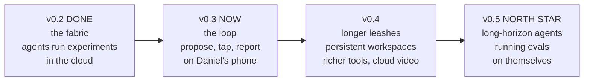

# v0.3 design: the daytime lab with Telegram delivery

Status: design approved by Daniel 2026-08-18 (brainstormed: cadence B event-driven, approvals A tap-buttons); this spec is the binding authority for the v0.3 implementation plan.
Supersedes the delivery sections of docs/plans/2026-08-17-v03-daytime-lab-draft.md; governance and researched-roster rules there remain in force.

## The product

AgentLab talks to Daniel on Telegram (bot @your_bot, chat id 123456789) the moment things happen, and Daniel steers it with taps.
Proposer runs START on schedule (09:30 and 12:00 Amsterdam); every MESSAGE is event-driven: an experiment finalizes, a proposal is ready, a champion changes.
Ping format: STE headline first, one key number, a chart image or video when one exists, APPROVE/REJECT inline buttons when a decision is needed.
Quiet hours 23:00-08:00 Amsterdam: pings queue and deliver at 08:00.
A tap writes the verdict to the ledger; approved registered work auto-submits to the fabric; rejected proposals archive with the rejection (anti-collapse memory).

## Components

1. `agentlab/notify.py`: sendMessage/sendPhoto/sendVideo to Telegram from workers; reads token/chat-id from SSM Parameter Store (/agentlab/telegram/bot-token SecureString, /agentlab/telegram/chat-id); quiet-hours queueing via a DynamoDB pending-pings partition flushed by the next scheduled run.
2. Approvals webhook: a Lambda (Python, no container) behind a function URL registered as the bot's webhook with a Telegram secret token; validates the secret header and that callback_query.from.id == Daniel's id; writes APPROVED/REJECTED to the proposals ledger; answers the callback (checkmark toast) and edits the message to show the decision.
3. `agentlab worker propose`: runs on the existing Fargate pattern at the scheduled times via EventBridge Scheduler -> SQS (a new message type routed by the existing pipe/machine? NO: proposer is not an experiment - Scheduler targets ECS RunTask directly for the proposer task definition).
   Reads a fixed v0.3 source list: GitHub releases/tags of tracked repos (deepseek-harness, inspect_ai, langgraph, claude-agent-sdk, strands), arXiv cs.CL/cs.AI new agent-relevant listings, Hacker News front page.
   Applies the anti-collapse rules: proposals ledger with accepted/rejected/completed archives, distance-to-archive statement per proposal, fresh-external-source anchoring with citation.
   Files proposals to the ledger; pings Daniel per proposal batch (one message, buttons per item capped at 3/day); auto-submits ONLY registered templates (tournament re-runs, approved entrants, model intake on existing suites) within standing caps.
4. Ledger: proposals live in the existing agentlab-state DynamoDB table under PK proposal#<id> with S3 for full proposal docs; no new database.
5. Experiment-finalize pings: the finalize worker calls notify with the verdict headline + report link (+ chart PNG rendered via matplotlib).

## Security

Bot token + webhook secret in SSM Parameter Store (SecureString); never in the repo or image.
Webhook authorizes ONLY Daniel's chat id; foreign taps are ignored and logged.
Proposer task role: Bedrock invoke + its own S3/DynamoDB slots + SSM read of the two telegram parameters; nothing else.
Lambda role: ledger write + SSM read + logs; nothing else.
New spend classes still require a tap; the $50 budget alarm and per-tournament caps remain the hard floors.

## Deferred to later versions (the destination, not exclusions)

The north star (Daniel, 2026-08-19): autonomous agents over long-horizon sessions, running evals on themselves, with Daniel steering by taps and learning from the output.
Escalation principle (Daniel, 2026-08-19): agents own their tools (CLI, MCP, skills, the fabric) and act freely inside the sandbox; escalation to Daniel is ONLY for actions that need his authority, like messaging humans or opening a new spend class. v0.3 gates more than that (new hypotheses still need taps); the gate narrows toward authority-only as trust is earned.
v0.3 deliberately ships the smallest loop that talks to him; each rung below is planned, gated by the authority ladder, and lands in a later version:
- In-cloud video rendering (v0.4 candidate: manim in the worker image, videos without the laptop).
- Computer use and richer tools in persistent environments (v0.4+: capability from containers, authority per mission).
- Long-horizon self-evaluating agents (the core goal: agents whose own trajectories feed the eval loop that gates them).
- Lab site for sharing findings (trigger: first time Daniel wants to share externally).
- Outreach to humans, e.g. the expert-call agent (last rung: highest authority, approval-gated end to end).
Not planned at any version: Hermes touchpoints (separate project) and email digests (Telegram replaced them).

## Setup already done

Bot created by Daniel via BotFather (t.me/Learn1901_bot); first ping delivered 2026-08-18 with dummy buttons; chat id captured.
Pending on Daniel's next aws login: storing token/chat-id in SSM.

## Acceptance (v0.3 done means)

1. A scheduled proposer run fires with no laptop involved, files at least one cited proposal, and pings Daniel.
2. Daniel taps APPROVE on a registered re-run proposal from his phone; the run auto-submits, completes, and the finalize ping arrives with the verdict.
3. A tap from any other Telegram account does nothing.
4. Quiet hours hold a 02:00 finding until 08:00.
5. Everything torn down with terraform destroy; idle cost stays ~$0.
