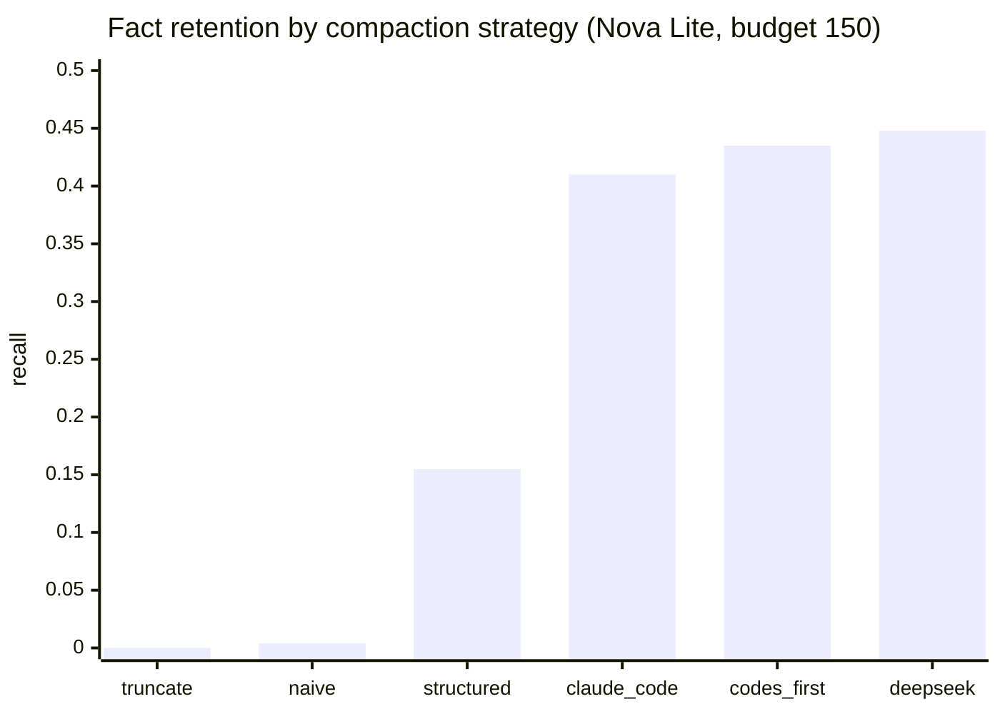

# Tournament 001: compaction strategies - round 1 leaderboard

Corpus: 12 planted facts, 120 filler turns, summary budget 150 tokens, Nova Lite, paired seeds.
Champion rule: the crown changes only when a challenger beats the incumbent with a CI excluding zero.
Round 1 date: 2026-08-17. Total round spend: ~$1.45.

| Rank | Entrant | Recall | Delta vs champion | 95% CI | Verdict | Evidence |
|---|---|---|---|---|---|---|
| 1= | codes_first (champion) | 0.42-0.45 | - | - | incumbent | exp-20260816T152315Z (vs structured) |
| 1= | deepseek_style | 0.448 | +0.007 | [-0.048, +0.061] | INCONCLUSIVE (tie) | exp-20260817T190638Z-bbd1 |
| 1= | claude_code_style | 0.410 | -0.013 | [-0.072, +0.045] | INCONCLUSIVE (tie) | exp-20260817T190633Z-d991 |
| 4 | structured | 0.155 | -0.268 | [-0.329, -0.207] | beaten | exp-20260816T152315Z |
| 5 | naive | 0.004 | -0.448 | [-0.566, -0.331] | REJECT | exp-20260817T194620Z-029a |
| 6 | truncate | 0.000 | -0.450 | [-0.572, -0.328] | REJECT | exp-20260817T194615Z-6d44 |

## The finding: compaction is a three-tier cliff, not a gradient

Tier 1 (~0% retention): strategies with no preservation intent (truncate, naive).
Tier 2 (~16%): generic "preserve identifiers" intent without priority structure (structured).
Tier 3 (~41-45%): identifier-explicit prompts with priority or format structure - and inside this tier, three independently-derived prompts (ours, Anthropic-documented-style, DeepSeek's shipped prompt) are statistically indistinguishable.
The intent tiers are worth everything; the wordsmithing between serious prompts is worth nothing measurable at n=51.

## Street-test explainers (ASD-STE-100)

**truncate.** Delete the old half of the conversation. Everything in it is gone forever. Retention: zero, by construction.

**naive.** "Summarize the conversation concisely." The model writes a good summary that mentions codes exist and does not write one of them. Generic summaries describe; they do not copy. Retention: ~0%.

**structured.** "Summarize and preserve identifiers and codes." The intent is right, but with no priority order, the model spends its budget on narrative before codes. Retention: ~16%.

**claude_code_style.** Claude Code's documented priorities, operationalized: objectives first, then decisions and state with exact identifiers, then constraints, then recency; drop whole low-priority categories before shortening high ones. Retention: ~41%.

**codes_first (champion).** List every identifier and code verbatim first, one per line; summarize the rest only if budget remains. Retention: ~42-45%.

**deepseek_style.** DeepSeek Harness's shipped prompt (verbatim-sourced, commit 99f6f02): act as a compaction engine, write a structured checkpoint in terse bullets, preserve exact identifiers and values. Retention: ~45%.

## Haiku confirmation (round 1 closer)

On Haiku 4.5 the Nova tie breaks: codes_first 0.913 vs deepseek_style 0.800, delta -0.113, CI [-0.142, -0.084], verdict REJECT for the challenger (exp-20260817T195450Z-cedf, 15 tasks x 3 repeats).
The champion keeps the crown decisively.

## Refined finding

The three-tier cliff holds on the weak model, and the top-tier tie is capability-bound: on Nova Lite all serious prompts saturate what the model can do (~0.44) and are indistinguishable; on Haiku the extra headroom reveals a real within-tier order, and codes-first-formatting beats DeepSeek's checkpoint-bullets by 11 points.
Plain version: on a weak model, only intent matters; on a strong model, format starts to matter too, and listing the codes first wins.

ROUND 1 CLOSED 2026-08-17. Total round spend ~$2.80 of the $8.00 cap.
